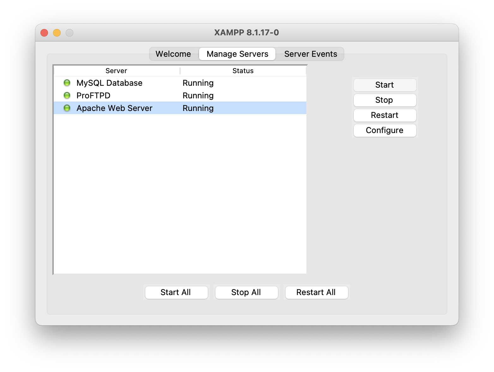
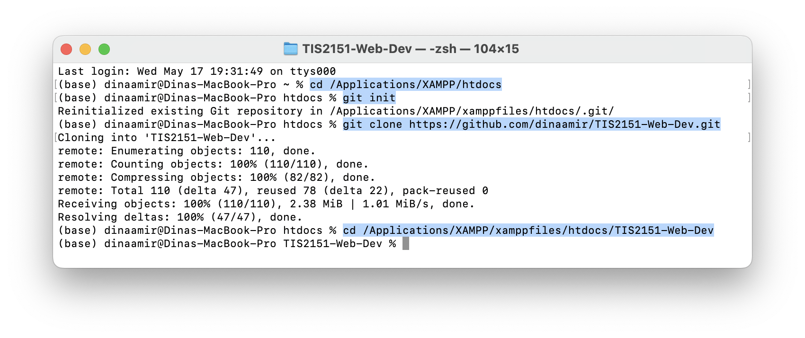
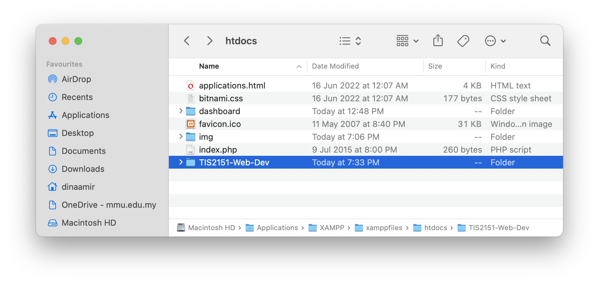
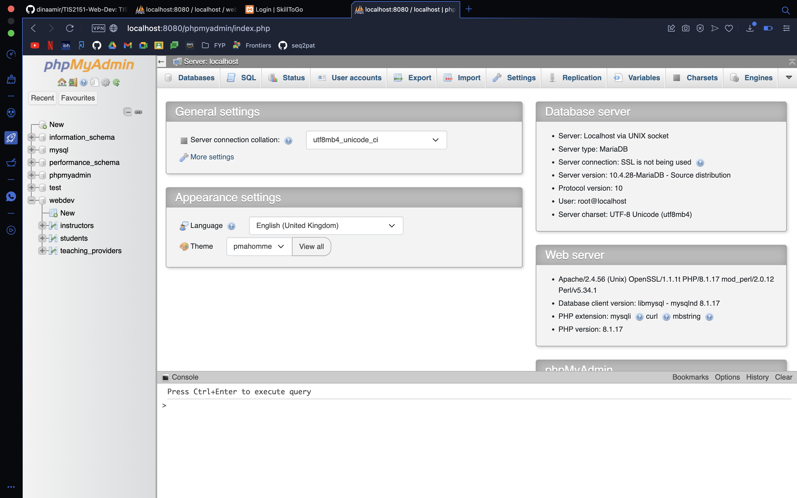
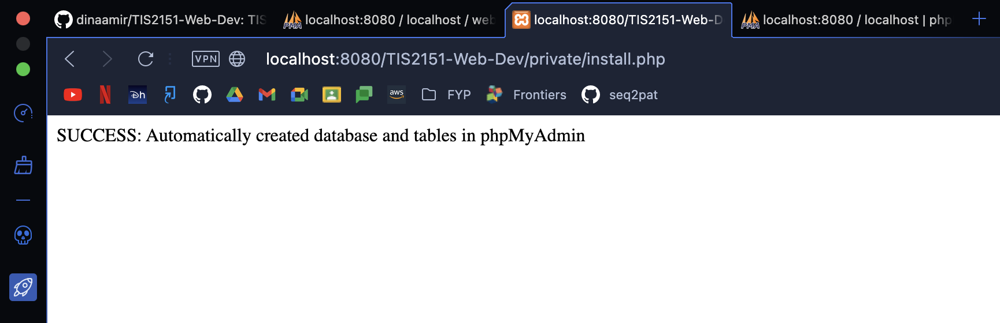
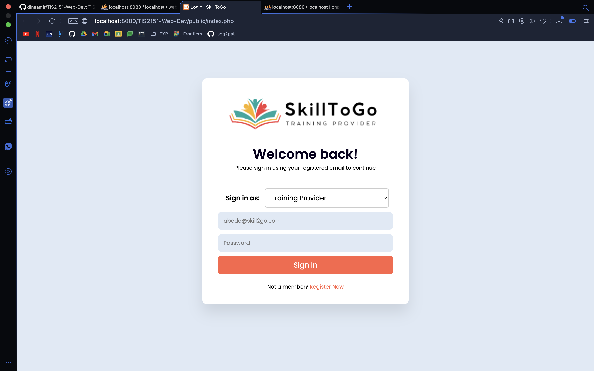

# TIS2151 Assignment - Group 4

## **Important Notes**
Please name your html/php files according to the criteria below: 
- Training provider: training_provider.html / training_providers.php
- Student: students.html / student.php
- Instructor: instructor.html / instructor.php

This is because the table names are already set in phpMyAdmin as **training_provider**, **student**, and **instructor**.

## **Instructions**
1. Install XAMPP (https://www.apachefriends.org/download.html)
2. Install Git (https://git-scm.com/downloads)
3. Open XAMPP Manager > Manage Servers > Start All (wait for Status changes to Running)

4. Open terminal/cmd > Direct to XAMPP/htdocs folder (```cd /Applications/XAMPP/htdocs```) > Initialised git (```git init```) > Clone the GitHub repo (```git clone https://github.com/dinaamir/TIS2151-Web-Dev.git```). Now, your TIS2151-Web-Dev folder is saved in the XAMPP/htdocs (edit from this folder from now on)


5. Go to http://localhost/dashboard/ and click phpMyAdmin (this is where the database is stored)

6. Open a new tab and go to http://localhost:8080/TIS2151-Web-Dev/private/install.php. This link will automatically create database and tables in phpMyAdmin for firstimers

7. Go to http://localhost:8080/TIS2151-Web-Dev/public/index.php to reach the login page


